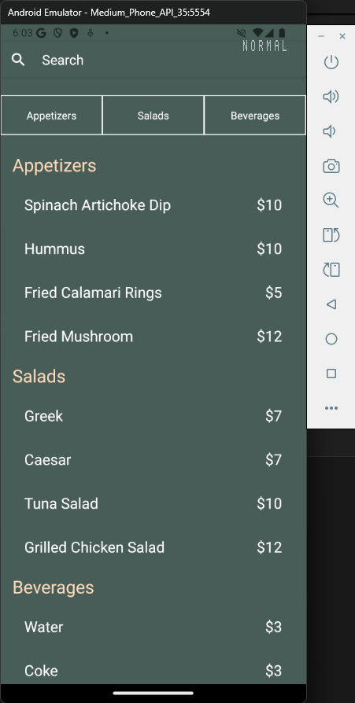
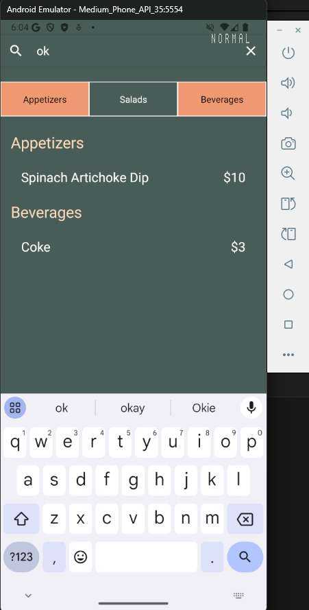

# Meta React Native Specialization - Working With Data | Portfolio-Project

## Description

For the Meta React Native Specialization - Working With Data | Portfolio-Project, I completed the excercises what asked in these part of the Meta React Native Specialization course.
This is a functional React Native App, where the user can search and querying items based on the user inputs. 
 
## Screenshot(s)

### Application:




## Used Software(s)
- Visual Studio Code
- Android Studio

## Run Locally

Note: Please ensure you have installed <code><a href="https://nodejs.org/en/download/">nodejs</a></code>

Clone my repository
```bash
  https://github.com/istvanszasz99/Meta_React_Native_Specialization_Working_With_Data_Portfolio_Project.git
```

Go to the project directory & install dependencies
```bash
  npm install
```

View project in Emulator or Physical Device
```bash
  npm start
```

## Author
- [@istvanszasz99](https://www.github.com/istvanszasz99)
